# AWS-ML-Operationalizing - WriteUp
Project "Operationalizing an AWS Machine Learning Project" (part of Udacity nd189)

## Intro

This project focuses on the operationalizing of a completed ML Project in AWS SageMaker.
The project uses several important tools and features of AWS to adjust, improve, configure, and prepare the model for production-grade deployment.
The following aspects of AWS machine learning operations are regarded:
- How to manage computing resources efficiently
- How to train models with large datasets using multi-instance training
- How to set up high-throughput, low-latency pipelines
- How to exploit AWS security

## Step 1: Training & deployment in AWS Sagemaker

### 1.1 Creation of Jupyter Notebook in Sagemaker Studio 
The notebook was created using the instance "type ml.t3.medium" (see screenshot), which should be an adequate choice since it provides sufficient performance for most typical tasks, but reasonably limits costs. In case more power is needed, a change of the instance type to one with more power (e.g., "ml.m5.xlarge") could be the next step.

The notebook uses the AWS Execution Role also shown in the screenshot. Moreover, this execution role was given the S3FullAccess permission to be able to communicate with S3 buckets.


### 1.2 Creation of S3 Bucket
To be able to save and provide data to Sagemaker, the following S3 bucket (see screenshot) was created in the AWS account.


### 1.3 Deployment & Training on Sagemaker notebook
Training on Sagemaker was performed in two different ways:
- Using single-instance training with 1 ml.m5.xlarge instance
- Using multi-instance training with 4 ml.m5.xlarge instances

You can see the log steams of the training jobs that have been used for Sagemaker training at June 16, 2026, in the following screenshot. The screenshot shows the one job of the single-instance training (last event time at 07:09:25) as well as the 4 jobs of the multi-instance training (last event times between 07:09:27 and 07:09:28).


Every PyTorch training job uses the SageMaker execution role with S3FullAccess permission on the created S3 bucket which holds the test, training and validation data.
Both the single-instance and multi-instance jobs completed successfully. Details will be provided in the following paragraphs.


#### 1.3.1 Single-instance training
Single-instance training was performed using 1 ml.m5.xlarge instance. It took around 20 minutes for training (1174 training seconds) and completed successfully.


#### 1.3.2 Multi-instance training
Multi-instance training was performed using 4 ml.m5.xlarge instances. It took around the same 20 minutes for training (1181 training seconds) and also completed successfully.


After successful training, the following endpoint was deployed:
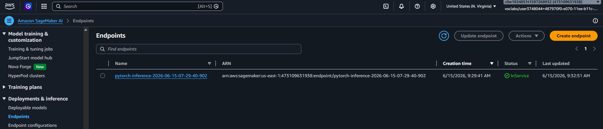


We performed an inference test on the deployed endpoint using an image of a Carolina Dog.
As a result, we received the 91th class in the array (array[90], i.e. the 91th entry) which got the maximum inference value of around 0.92, as one can see in the screenshot from the Jupyter Notebook (train_and_deploy-solution.ipynb).
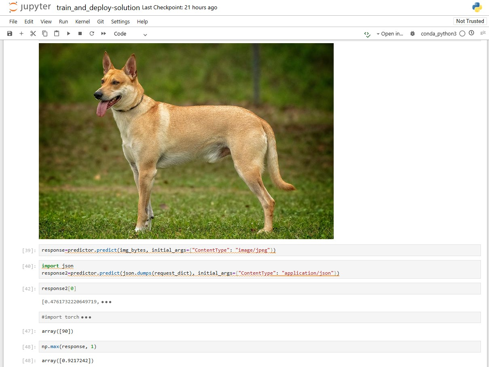

## Step 2: Training on EC2

For training on EC2, an EC2 instance was launched with the following parameters:
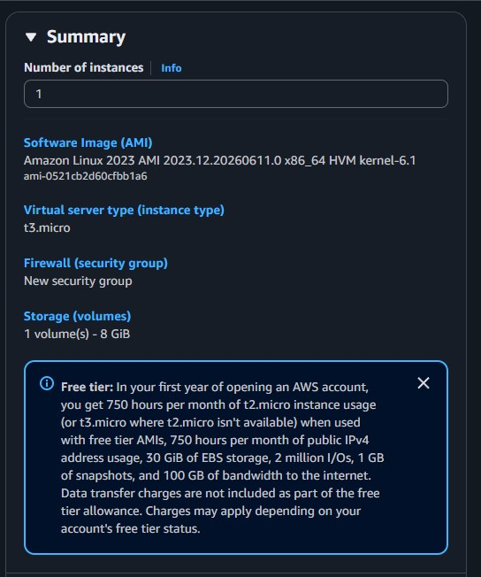

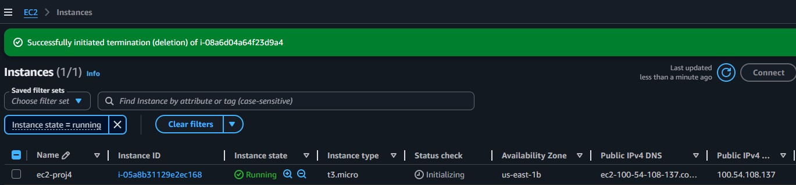

An instance type of t3.micro was used to minimize the costs. Moreover, there is a free-tier option for this instance type available, reducing EC2 costs actually down to zero within this project.
The following Amazon Machine Image (AMI) was used: Deep Learning AMI with Single CUDA (Amazon Linux 2023)

To run the EC2 variant e.g. via Terminal, just use the standalone EC2 path when you want to train outside SageMaker-managed jobs.

```bash
wget https://s3-us-west-1.amazonaws.com/udacity-aind/dog-project/dogImages.zip
unzip dogImages.zip
mkdir -p TrainedModels
python ec2train1.py
```
ec2train1.py expects the extracted dataset under dogImages/ and saves the trained weights to TrainedModels/model.pth.

Training on EC2 was performed successfully, as one can see in the following screenshot.

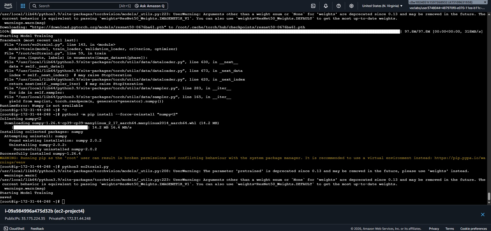

The trained model weights were saved under the given path.

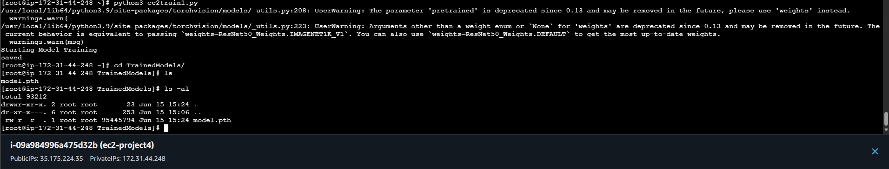

The overall process overall is similar to training the model on SageMaker. However, it needs more manual effort in many steps:
- The code needs to be adapted to include extra loaders and loggers in order to get intermediate logs, since the visiblity during training is not given when compared to SageMaker.
- Setting up multi-instance training using EC2 also needs more attention than in SageMaker where a simple parameter has to be changed. In EC2, the manual setup and management of clusters would be necessary.
- It is also not possible to directly deploy an endpoint of the trained model, which is quite simple in SageMaker.

Thus, as one can see, there is a significant tradeoff between cost and ease-of-use that has to be considered when comparing these two methods.

## Step 3: Setup of Lambda function

When setting up the Lambda function 'uda-p4-lambda', the starter code lambda_function.py was used.
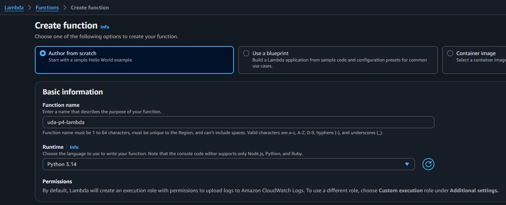

The only changed that has been made was to change the name of the endpoint to 'pytorch-inference-2026-06-15-07-29-40-902', being the endpoint which has been previously deployed (see above).
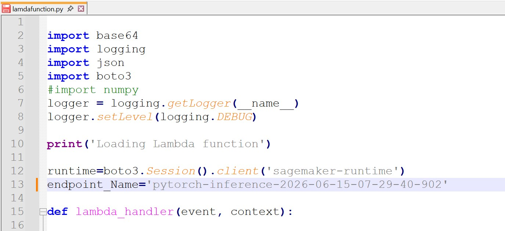

In the following figure, you can see the code added to the lambda function.
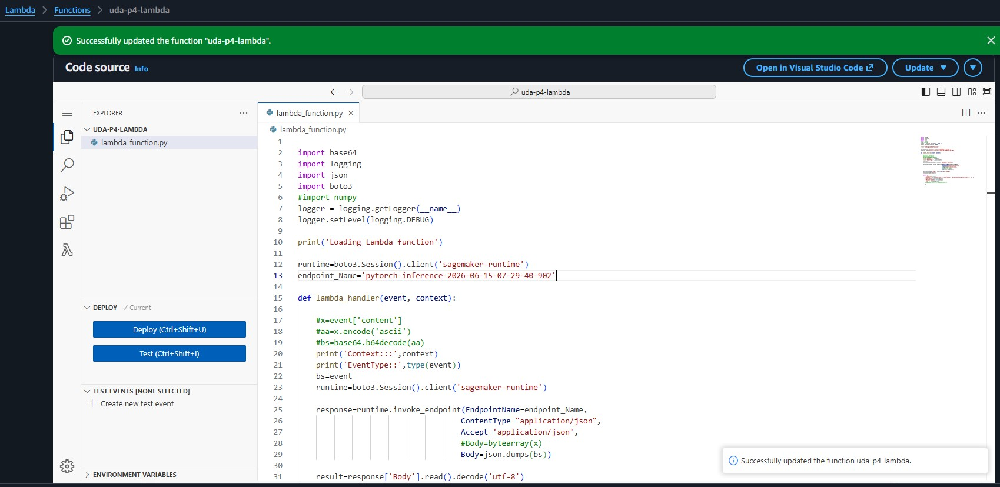

To be able to test invocations on the endpoint using the Lambda function, the following Test Event was created, representing the URL to a picture of a Carolina Dog (https://s3.amazonaws.com/cdn-origin-etr.akc.org/wp-content/uploads/2017/11/20113314/Carolina-Dog-standing-outdoors.jpg) which is also depicted above.
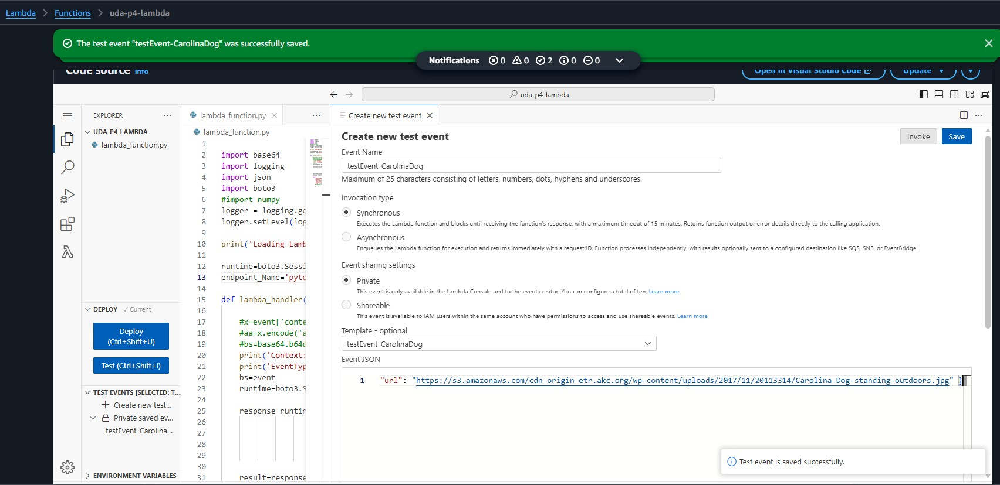

## Step 4: Lambda security setup & testing

When trying to invoke the Lambda function using the created test event, the following client error occured: 
```bash
"An error occurred (AccessDeniedException) when calling the InvokeEndpoint operation: User: arn:aws:sts::473109631938:assumed-role/uda-p4-lambda-role-8dcd6cv7/uda-p4-lambda is not authorized to perform: sagemaker:InvokeEndpoint on resource: arn:aws:sagemaker:us-east-1:473109631938:endpoint/pytorch-inference-2026-06-15-07-29-40-902 because no identity-based policy allows the sagemaker:InvokeEndpoint action
```

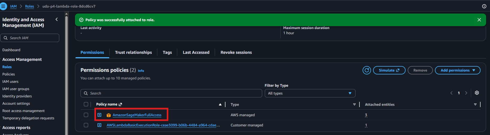

The reason for this error are insufficient privileges for the role of the Lambda function 'uda-p4-lambda' to access the SageMaker inference endpoint.
This can be fixed by adding a policy with the respective SageMaker privileges in AWS IAM.

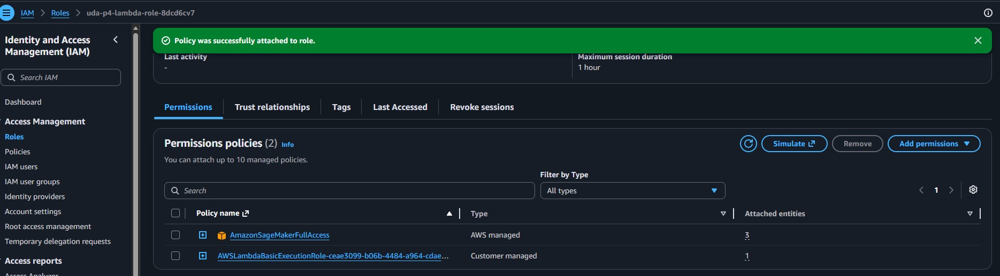

After attaching an IAM role with the sufficient privileges (AmazonSagemakerFullAccess - though this might be a bit too extensive and could be restricted to a customized policy which allows only access to a specific endpoint), the invocation of the endpoint was successful and returned the weights for all of the dog classes, as one can see in the screenshot and the depicted Response message.

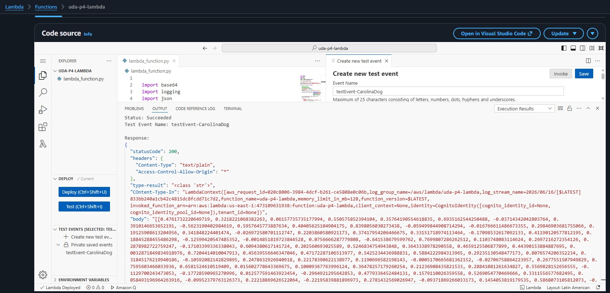

```bash
Response:
{
  "statusCode": 200,
  "headers": {
    "Content-Type": "text/plain",
    "Access-Control-Allow-Origin": "*"
  },
  "type-result": "<class 'str'>",
  "COntent-Type-In": "LambdaContext([aws_request_id=020c8006-3984-4dcf-b261-ce5808e0c06b,log_group_name=/aws/lambda/uda-p4-lambda,log_stream_name=2026/06/16/[$LATEST]833bb240a1cb42c4815dc8fcdd71c7d2,function_name=uda-p4-lambda,memory_limit_in_mb=128,function_version=$LATEST,invoked_function_arn=arn:aws:lambda:us-east-1:473109631938:function:uda-p4-lambda,client_context=None,identity=CognitoIdentity([cognito_identity_id=None,cognito_identity_pool_id=None]),tenant_id=None])",
  "body": "[[0.4761732220649719, 0.3218221068382263, 0.06157735735177994, 0.550575852394104, 0.35764190554618835, 0.6935162544250488, -0.03714342042803764, 0.3910146653652191, -0.5623190402984619, 0.5957645773887634, 0.40405625104904175, 0.8398056030273438, -0.059499844908714294, -0.016766611486673355, 0.29846903681755066, 0.19125908613204956, 0.341848224401474, -0.026972580701112747, 0.2203860580921173, 0.37417954206466675, 0.33151718974113464, -0.17098532617092133, 0.41190120577812195, 0.18845288455486298, -0.12599420547485352, -0.0014851819723844528, 0.0756666287779808, -0.641538679599762, 0.7699807286262512, 0.1103748083114624, 0.2697216272354126, 0.2878982722759247, -0.17103399336338043, 0.6094380617141724, 0.202560693025589, 0.5246834754943848, 0.3643338978290558, 0.4659125506877899, 0.44390153884887695, 0.0032871849834918976, 0.7204414010047913, 0.45639556646347046, 0.47172287106513977, 0.5425234436988831, 0.5884222984313965, 0.29235130548477173, 0.8076574206352234, 0.31845176219940186, -0.10592082142829895, 0.2478632926940918, 0.22178390622138977, 0.1190696582198143, -0.0005170665681362152, -0.02706758864223957, 0.2677551507949829, 0.7595603466033936, 0.6581524610519409, 0.015602778643369675, 0.10009367763996124, 0.36478257179260254, 0.21236908435821533, 0.28841081261634827, 0.5569828152656555, -0.1129700243473053, -0.17728590965270996, 0.012577591463923454, -0.2964921295642853, 0.4779336452484131, 0.1579110026359558, 0.5269054770469666, 0.3311556577682495, 0.058493196964263916, -0.09952379763126373, 0.22218869626522064, -0.22195839881896973, 0.2781432569026947, -0.09371869266033173, 0.1454053819179535, 0.5868073105812073, -0.019700832664966583, -0.08598071336746216, 0.27911749482154846, 0.1380557417869568, 0.1351855844259262, -0.4074932038784027, 0.1949203759431839, 0.5704998970031738, 0.1034805178642273, 0.4363984167575836, 0.28100574016571045, 0.9217242002487183, 0.06679717451334, -0.324487566947937, 0.3081735670566559, -0.15274477005004883, -0.03188425675034523, -0.2742329239845276, 0.3731641173362732, -0.1888727992773056, -0.534474790096283, 0.31442585587501526, -1.0149083137512207, 0.18130312860012054, 0.04081594571471214, -0.522244393825531, 0.3494240343570709, 0.20389579236507416, -0.3971045911312103, 0.20931527018547058, -0.1616487056016922, -0.037536054849624634, -0.17386570572853088, 0.03207036480307579, -0.03185570240020752, 0.6484061479568481, -0.53797847032547, -0.12692445516586304, 0.16882047057151794, -0.14198072254657745, 0.025796376168727875, -0.2808223068714142, -0.4903872013092041, 0.045840784907341, 0.23447871208190918, 0.04474719613790512, -0.698573648929596, 0.05486345291137695, -0.3420224189758301, 0.10108108818531036, 0.5497212409973145, -0.31533387303352356, -0.23713074624538422, -0.1172204539179802]]"
```
### Thoughts about Security Vulnerabilites

- As mentioned above, attaching the "AWSSagemakerFullAccess" policy provides far-reaching privileges, which allows the role to perform more than only invocating a deployed endpoint. This could lead to security breaches
- Roles should always be reviewed carefully and old or inactive roles should be removed or at least granted only the minimum needed policies.
- The same holds for roles with policies for functions that the project is no longer using - the respective policies should be removed

## Step 5: Endpoint Auto-Scaling & Lambda Concurrency setup

The following endpoint with the best hyperparameters for inference was deployed:
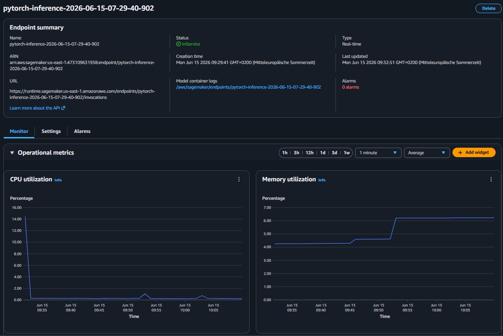

### 5.1 Endpoint Auto-Scaling

Then, Auto-Scaling for the endpoint was enabled:
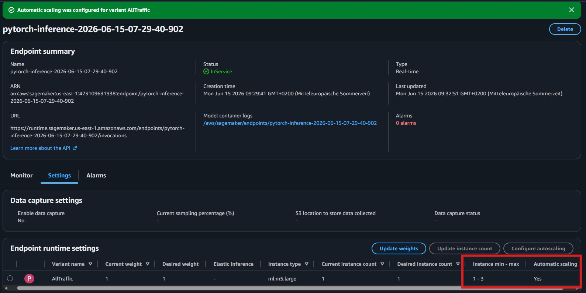

In detail, the following settings were taken which allow to profit from the advantages of Auto-Scaling, while limiting the potentially incurred extra costs:
- The number of instances was defined to be between 1 and 3, i.e., a maximum of 3 instances will be simultaneously available if needed
- A target value of 10 simultaneous invocations as trigger for Auto-Scaling enablement was selected, with scale in/out cool down times of 30, respectively. This allows an acceptably quick response on changing traffic demands with temporarily high throughputs.
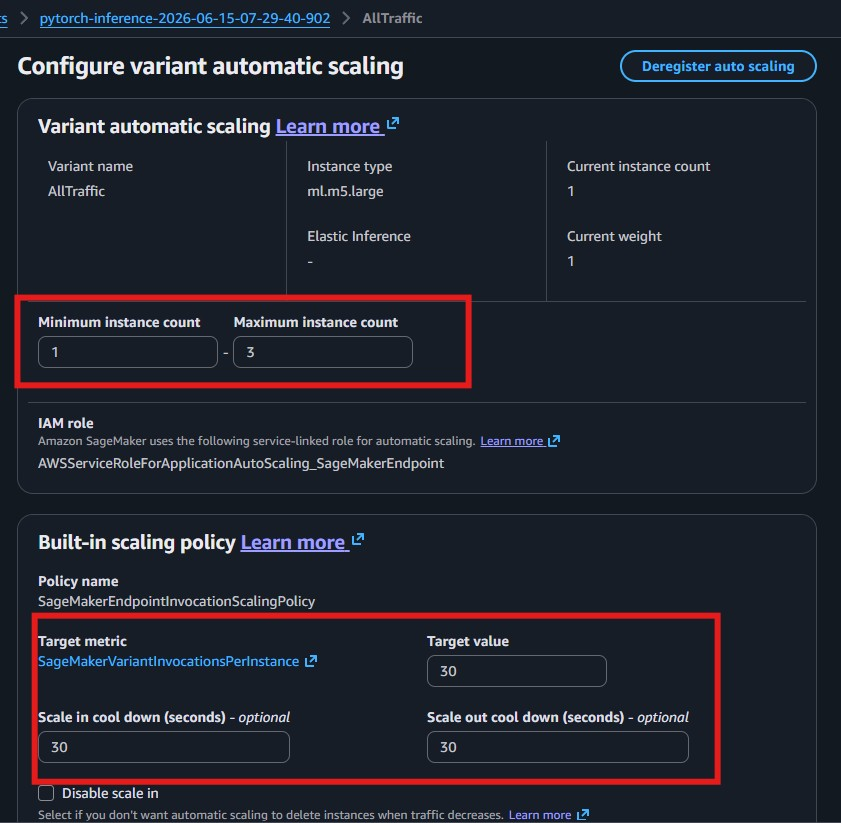

### 5.2 Lambda Concurrency

To enbale concurrency for the Lambda function uda-p4-lambda without incurring too high costs, we have set a reserved concurrency of 5 and provisioned 3 instances. 
I.e., we can handle 3 incoming requests simultaneously, which is stable enough for an average number of invocations from users or apps, while additionally reserving some extra capacity. Like for Auto-Scaling, these settings should help in practice in high-throughput low-latency situations, while not increasing charges too much at the same time.
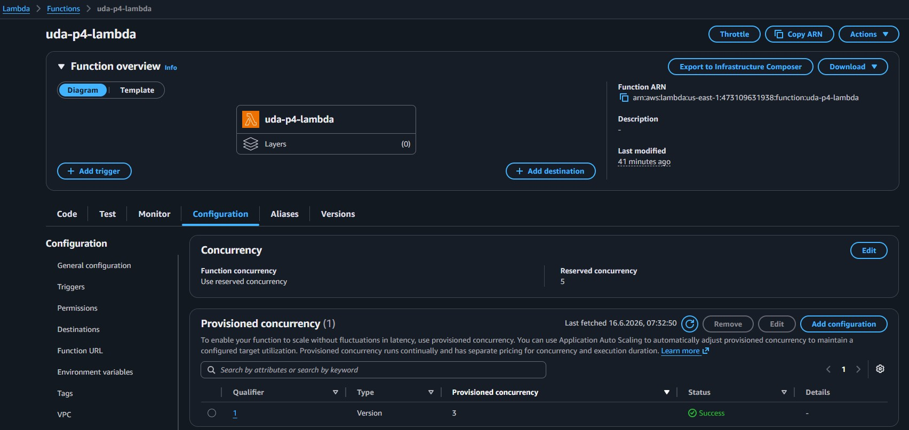
