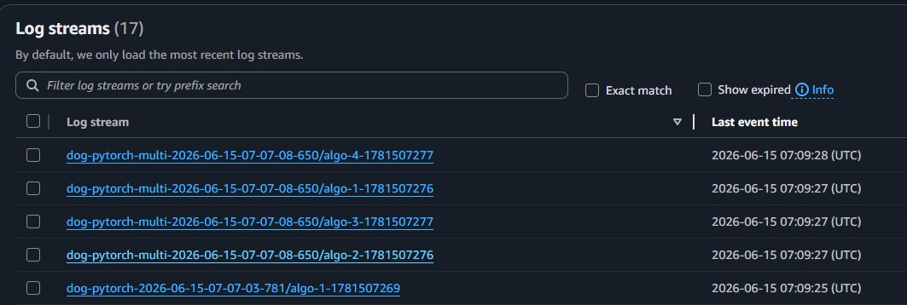
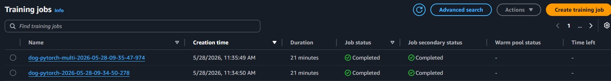
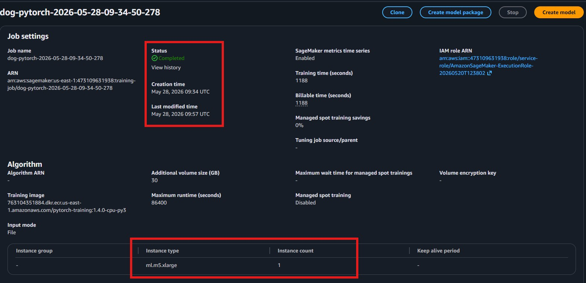
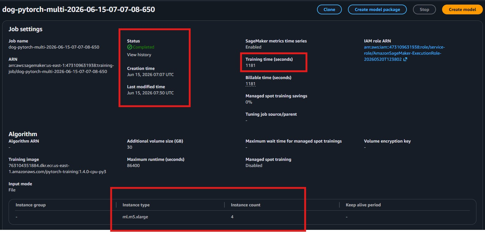

# AWS-ML-Operationalizing
Project "Operationalizing an AWS Machine Learning Project" (part of Udacity nd189)

## Intro

This project focuses on the operationalizing of a completed ML Project in AWS SageMaker.
The project uses several important tools and features of AWS to adjust, improve, configure, and prepare the model for production-grade deployment.
The following aspects of AWS machine learning operations are regarded:
- How to manage computing resources efficiently
- How to train models with large datasets using multi-instance training
- How to set up high-throughput, low-latency pipelines
- How to exploit AWS security

## Step 1: Training & deployment in AWS Sagemaker

### 1.1 Creation of Jupyter Notebook in Sagemaker Studio 
The notebook was created using the instance "type ml.t3.medium" (see screenshot), which should be an adequate choice since it provides sufficient performance for most typical tasks, but reasonably limits costs. In case more power is needed, a change of the instance type to one with more power (e.g., "ml.m5.xlarge") could be the next step.

The notebook uses the AWS Execution Role also shown in the screenshot. Moreover, this execution role was given the S3FullAccess permission to be able to communicate with S3 buckets.


### 1.2 Creation of S3 Bucket
To be able to save and provide data to Sagemaker, the following S3 bucket (see screenshot) was created in the AWS account.


### 1.3 Deployment & Training on Sagemaker notebook
Training on Sagemaker was performed in two different ways:
- Using single-instance training with 1 ml.m5.xlarge instance
- Using multi-instance training with 4 ml.m5.xlarge instances

You can see the log steams of the training jobs that have been used for Sagemaker training at June 16, 2026, in the following screenshot. The screenshot shows the one job of the single-instance training (last event time at 07:09:25) as well as the 4 jobs of the multi-instance training (last event times between 07:09:27 and 07:09:28)


Every PyTorch training job uses the SageMaker execution role with S3FullAccess permission on the created S3 bucket which holds the test, training and validation data.
Both the single-instance and multi-instance jobs completed successfully. Details will be provided in the following paragraphs.


#### 1.3.1 Single-instance training
Single-instance training was performed using 1 ml.m5.xlarge instance. It took around 20 minutes for training (1174 training seconds) and completed successfully.




#### 1.3.2 Multi-instance training
Multi-instance training was performed using 4 ml.m5.xlarge instances. It took around the same 20 minutes for training (1181 training seconds) and also completed successfully.



After successful training, the following endpoint was deployed:

We performed an inference test on the deployed endpoint using the Carolina Dog image shown in the following.


As a result, we got class 90 which got the maximum inference value of around 0.92.

## Step 2: Training on EC2

For training on EC2, an EC2 instance was launched with the following parameters:


An instance type of t3.micro was used to minimize the costs. 
The following Amazon Machine Image (AMI) was used: Deep Learning OSS Nvidia Driver AMI GPU PyTorch 2.11 (Amazon Linux 2023)

To run the EC2 variant e.g. via Terminal, use the standalone EC2 path when you want to train outside SageMaker-managed jobs.

```bash
wget https://s3-us-west-1.amazonaws.com/udacity-aind/dog-project/dogImages.zip
unzip dogImages.zip
mkdir -p TrainedModels
python ec2train1.py
```

ec2train1.py expects the extracted dataset under dogImages/ and saves the trained weights to TrainedModels/model.pth.

## Step 3: Setup of Lambda Function

## Step 4: Lambda security setup & testing

## Step 5: Endpoint Auto-Scaling & Lambda Concurrency setup

The following endpoint with the best hyperparameters for inference was deployed:


Then, Auto-Scaling for the endpoint was enabled:


In detail, the following settings were taken:
- Number of instances was defined to be between 1 and 3, i.e. the maximum of 3 instances will be simultaneously available if needed
- A target value of 10 simultaneous invocations as trigger for Auto-Scaling enablement was selected, with scale in/out cool down times of 30, respectively. This allows an acceptably quick response on changing traffic demands with temporarily high throughputs.


To enbale concurrency for the Lambda function, we have set a reserved concurrency of 5 and provisioned 3 instances. 
I.e., we can handle 3 incoming requests simultaneously, which is stable enough for an average number of invocations from users or apps.

