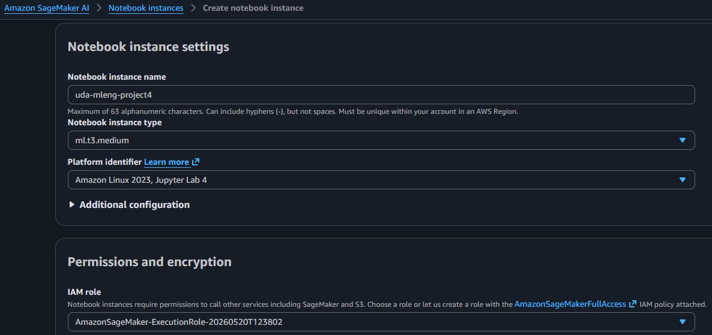
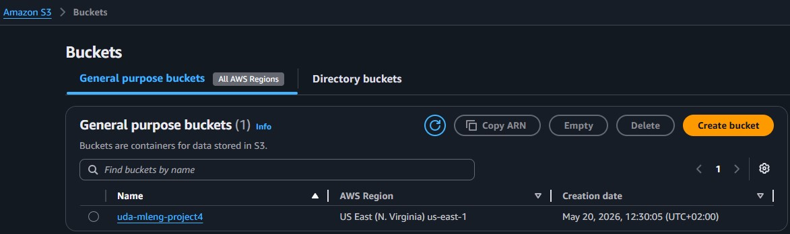

# AWS-ML-Operationalizing
Project "Operationalizing an AWS Machine Learning Project" (part of Udacity nd189)

## Intro

## Step 1: Training & deployment in AWS Sagemaker

### 1.1 Creation of Jupyter Notebook in Sagemaker Studio 
The notebook was created using the instance "type ml.t3.medium" (see screenshot), which should be an adequate choice since it provides sufficient performance for most typical tasks, but reasonably limits costs. In case more power is needed, a change of the instance type to one with more power (e.g., "ml.m5.xlarge") could be the next step.

The notebook uses the AWS Execution Role also shown in the screenshot.

### 1.2 Creation of S3 Bucket
To be able to save and provide data to Sagemaker, the following S3 bucket (see screenshot) was created in the AWS account.

- 
- 

## Step 2: Training on EC2

## Step 3: Setup of Lambda Function

## Step 4: Lambda security setup & testing

## Step 5: Lambda Concurrency setup & Endpoint Auto-scaling
