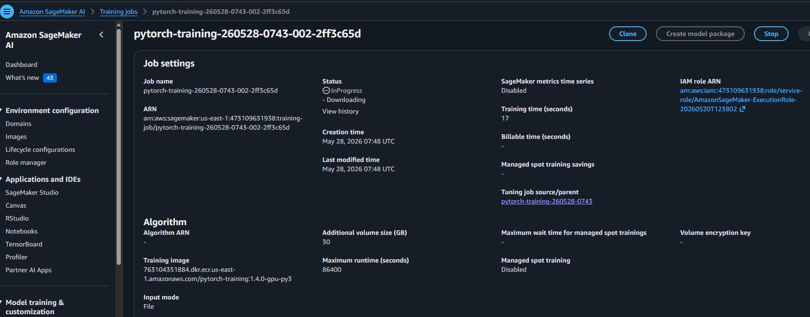

# AWS-ML-Operationalizing
Project "Operationalizing an AWS Machine Learning Project" (part of Udacity nd189)

## Intro

This project focuses on the operationalizing of a completed ML Project in AWS SageMaker.
The project uses several important tools and features of AWS to adjust, improve, configure, and prepare the model for production-grade deployment.
The following aspects of AWS machine learning operations are regarded:
- How to manage computing resources efficiently
- How to train models with large datasets using multi-instance training
- How to set up high-throughput, low-latency pipelines
- How to exploit AWS security

## Step 1: Training & deployment in AWS Sagemaker

### 1.1 Creation of Jupyter Notebook in Sagemaker Studio 
The notebook was created using the instance "type ml.t3.medium" (see screenshot), which should be an adequate choice since it provides sufficient performance for most typical tasks, but reasonably limits costs. In case more power is needed, a change of the instance type to one with more power (e.g., "ml.m5.xlarge") could be the next step.

The notebook uses the AWS Execution Role also shown in the screenshot. Moreover, this execution role was given the S3FullAccess permission to be able to communicate with S3 buckets.

### 1.2 Creation of S3 Bucket
To be able to save and provide data to Sagemaker, the following S3 bucket (see screenshot) was created in the AWS account.

### 1.3 Deployment & Training on Sagemaker notebook
Training on Sagemaker was performed in two different ways:
- Using single-instance training with 1 ml.m5.xlarge instance
- Using multi-instance training with 4 ml.m5.xlarge instances

You can see the training jobs that have been used for Sagemaker training at May 28, 2026, in the following screenshot. The screenshot shows the one job of the single-instance training (last event time at 09:37:14) as well as the 4 jobs of the multi-instance training (last event times between 09:38:18 and 09:38:20)

Every PyTorch training job uses the SageMaker execution role with S3FullAccess permission on the created S3 bucket which holds the test, training and validation data. The settings of an exemplary training job are shown in the following screenshot.

Both the single-instance and multi-instance jobs completed successfully. Details will be provided in the following paragraphs.

#### 1.3.1 Single-instance training
Single-instance training was performed using 1 ml.m5.xlarge instance. It took around 21 minutes for training (1188 billable seconds).

#### 1.3.2 Multi-instance training
Multi-instance training was performed using 4 ml.m5.xlarge instances. It took around the same 21 minutes for training (1211 billable seconds).

## Step 2: Training on EC2

## Step 3: Setup of Lambda Function

## Step 4: Lambda security setup & testing

## Step 5: Lambda Concurrency setup & Endpoint Auto-scaling

The following endpoint with the best hyperparameters for inference was deployed:

To enable Auto-Scaling for the endpoint, the following settings were taken:

To enbale concurrency for the Lambda function, we have set a reserved concurrency of 5 and provisioned 3 instances. 
I.e., we can handle 3 incoming requests simultaneously, which is stable enough for an average number of invocations from users or apps.

